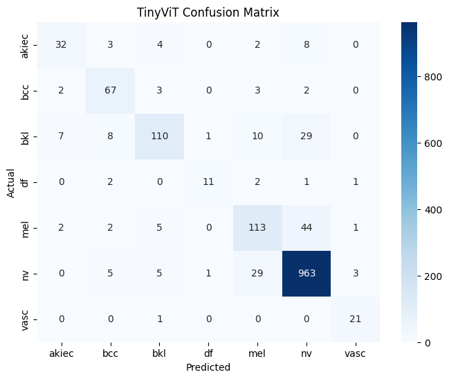
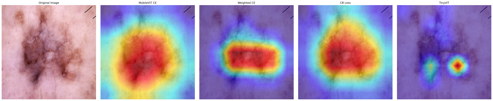
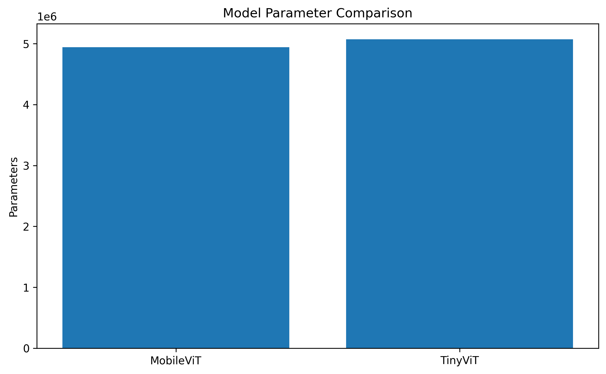

# Lightweight Vision Transformers for Skin-Lesion Classification

## Overview

This project investigates lightweight Vision Transformer architectures for
multiclass skin-lesion classification using the HAM10000 dataset.

The work focuses on:

- Lightweight deep-learning architectures
- Class-imbalance handling
- Minority-class performance
- Grad-CAM-based qualitative interpretation
- Parameter and inference-efficiency comparison

> This is a research and educational project. It is not intended for
> clinical diagnosis or medical decision-making.

## Dataset

The project uses the HAM10000 dataset, containing 10,015 dermoscopic images
from seven diagnostic categories:

- `akiec` — Actinic keratoses and intraepithelial carcinoma
- `bcc` — Basal cell carcinoma
- `bkl` — Benign keratosis-like lesions
- `df` — Dermatofibroma
- `mel` — Melanoma
- `nv` — Melanocytic nevi
- `vasc` — Vascular lesions

The dataset is not included in this repository.

## Models and Experiments

The repository evaluates:

1. MobileViT-S with standard cross-entropy
2. MobileViT-S with weighted cross-entropy
3. MobileViT-S with class-balanced loss
4. TinyViT-5M

The experiments also include Grad-CAM attention visualization and an
efficiency comparison between MobileViT and TinyViT.

## Repository Structure

```text
.
├── notebooks/
│   ├── 01_dataset_analysis.ipynb
│   ├── 02_baseline_mobilevit.ipynb
│   ├── 03_weighted_loss.ipynb
│   ├── 04_cb_loss.ipynb
│   ├── 05_tinyvit_baseline.ipynb
│   ├── 06_attention_visualization.ipynb
│   └── 07_efficiency_analysis.ipynb
├── outputs/
│   ├── figures/
│   ├── logs/
│   └── reports/
├── pyproject.toml
├── uv.lock
└── README.md
```

## Experiment Workflow

```text
Dataset analysis
        ↓
MobileViT baseline
        ↓
Weighted cross-entropy
        ↓
Class-balanced loss
        ↓
TinyViT evaluation
        ↓
Grad-CAM visualization
        ↓
Efficiency comparison
```

## Current Findings

Across the recorded experiments:

- TinyViT produced the strongest overall classification performance.
- Weighted and class-balanced losses were investigated to improve performance
  on minority lesion categories.
- Grad-CAM was used to compare qualitative attention patterns.
- MobileViT and TinyViT were compared in terms of model size and recorded
  inference latency.

Detailed results are available in the executed notebooks and the
`outputs/reports` directory.

## Visual Results

### TinyViT Confusion Matrix



### Attention Comparison



### Parameter Comparison



## Running the Project

The experiments were developed primarily in a Kaggle GPU environment.

Install the project dependencies using:

```bash
uv sync
```

Then launch Jupyter:

```bash
uv run jupyter lab
```

Run the notebooks sequentially from `01` to `07`.

The HAM10000 dataset paths used in the notebooks may need to be adjusted when
running outside Kaggle.

## Evaluation Protocol

The currently stored experiments use a stratified image-level split with:

- 70% training data
- 15% validation data
- 15% test data
- Random seed: 42

## Limitations

- The current experiments use an image-level split. Since HAM10000 may contain
  multiple images associated with the same lesion, lesion-level grouped
  evaluation is an important future validation step.
- The models have not been externally validated on an independent dataset.
- Grad-CAM outputs are qualitative explanations and do not establish clinical
  validity.
- Model checkpoints are not stored in the repository because of their size.
- Results can vary between training runs because of stochastic optimization.

## Technologies

- Python
- PyTorch
- timm
- MobileViT
- TinyViT
- scikit-learn
- pandas
- NumPy
- Matplotlib
- Seaborn
- Grad-CAM

## Disclaimer

This repository is intended only for academic research and learning. The
models must not be used for clinical diagnosis or patient-care decisions.
